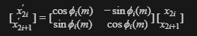

在大模型中，RoPE 在 attention 计算中对 Q、K 张量做旋转，使查询与键携带与位置相关的相位，从而在打分中体现相对位置。

# 为什么要做旋转位置编码

> attention = softmax( Q@K^T/sqrt(d_k) + mask ) @ V
>  其中： softmax( Q@K^T/sqrt(d_k) + mask ) 称作 attention score

每个 query 位置会对各个 key 位置算一个相似度分数，再 softmax 变成权重去加权 V。

Transformer 模型本身并不具备捕捉序列中单词顺序的能力.若 Q、K里完全不携带位置信息，很多情况下模型对 token 置换不敏感：同样的内容向量集合，打乱顺序仍可能得到非常相近的注意力分布，语言建模会崩。 

所以常见做法是：让参与打分的那一对向量 (q_m, k_n) 带上位置依赖，使分数 s_m_n 会随位置m、n（或它们的差）变化。

## 如何加入位置信息

经典的位置信息编码方法是通过对输入的 Q 和 K（注意力机制中的查询和键）的每个元素添加一个基于正弦和余弦函数的固定编码（Sinusoidal Positional Encoding），或者通过学习一个位置嵌入向量（learned positional embeddings）。

RoPE 的出现，则是为了改善传统方法在长序列上的表现，尤其是在模型需要捕捉长距离依赖时。RoPE 通过旋转的方法对 Q 和 K 进行编码，不仅能保留位置信息，还能帮助模型在较长的序列上进行更好的泛化。

### RoPE 的核心思想

RoPE 通过旋转操作来引入位置信息：在**每个 head 内**按**相邻两维**组成二维平面，对**每个这样的维对**施加一个 2×2 旋转（不是对单个标量独立旋转）。每个位置的编码由这些旋转的复合表示。

RoPE 利用复数的旋转变换来表示位置信息。位置编码的核心是对 Q 和 K 的元素进行旋转，而不是简单地相加。通过这种方式，RoPE 能够将不同位置的单词编码为旋转过的版本，这样它可以非常自然地捕捉到单词之间的相对位置关系。

### RoPE的数学原理：旋转的位置编码

假设我们有一个位置 i，对应一个向量 q_i 和 k_i。我们想要在对 Q 和 K 进行计算时加入位置信息。

#### 旋转矩阵

RoPE 的关键是利用复数的旋转变换。旋转矩阵可以写成以下形式：
```text
    R(Φ)=
    (
        cos(Φ),   −sin(Φ)
        sin(Φ),    cos(Φ)
    )
```
这里 **Φ** 即某一维对上的旋转角（由位置与频率共同决定；对第 **i** 个维对为 **Φ_i(m)**）。

把每个 head 里参与 RoPE 的向量维度记为 **d**（偶数）。对第 **i** 个维对 (2i, 2i+1)（i = 0, …, d/2−1），定义基频因子 **ω_i = θ₀^(−2i/d)**，其中 **θ₀** 为模型配置中的 `rope_theta`。

位置 **m** 上该维对的旋转角为 **Φ_i(m) = m · ω_i**（与实现里 `freq_scale`、逐块 `freq_factors` 等可再相乘，见后文）。

对二维向量进行旋转：

若 **q_m** 与 **k_n** 在各维对上按 **Φ_i(m)**、**Φ_i(n)** 做上述旋转，则注意力内积中出现**相对位置** **(n−m)** 的结构（RoPE：旋转把绝对位置编码成相对位置信息进入内积）。

工程实现里通常预计算 cos,sin（按位置与维度对索引），再对 Q、K 做融合乘加.
 
## 标准 RoPE 的计算过程

本节只写 **标准 RoPE**（旋转角由 `rope_theta`、位置 `m` 与块下标 `k` 决定，并可选用 `freq_scale` / `freq_factors` 做频率层面的缩放）。**带 YaRN 等扩展的 RoPE** 在后续章节单独展开。

**适用范围**：下文针对 **纯文本 LLM**（如 Qwen/Llama 等decoder-only 语言模型），**不适用多模态M-RoPE / 二维位置** 等。

「参考CPU的计算」

### 输入

**维序**：`ne[0]` = head 内宽度 `head_dim`，`ne[1]` = `n_heads`，`ne[2]` = `n_tokens`，`ne[3]` = `n_batch`

`T`表示前向过程使用的数据类型。

| Name | dtype | shape / value | 说明 |
|------|-------|----------------|------|
| `input_tensor` | `T` | [head_dim, n_heads, n_tokens, n_batch] | **Q** 或 **K** 投影后的分量。 |
| `position_ids` | `INT32` | [n_tokens, 1, 1, 1] | 每个 token 的位置 id。 |
| `freq_factors` | `FP32` | 非空：`ne[0] ≥ n_dims/2`；`freq_factors[k]` 对应维对 `k`。`NULL` 时因子按 **1**。 | 逐块频率缩放。 |
| `n_dims` | `INT32` | 偶数，`≤ ne0` | 前 `n_dims` 维参与旋转。 |
| `rope_mode` | `INT32` | `GGML_ROPE_TYPE_*`（如 NORMAL / NEOX） | 决定 `rotate_pairs` 的布局分支。 |
| `freq_base` | `FP32` | 如 **10000**（`rope_theta`） | `theta_scale = powf(freq_base, -2/n_dims)`。 |
| `freq_scale` | `FP32` | 常为 **1** | 与位置 `m`、各块 `theta_scale^k` 一起乘入旋转角。 |
| `sin_sign` | `FP32` | `+1` / `-1` | 乘在 **sin** 上。 |


构图形参 `inplace` 只决定 **输出tensor** 是否与 **输入tensor** 共享存储。

### 输出

| Name | dtype | shape | 说明 |
|------|-------|----------------|------|
| 旋转后的`Q`/`K` | 与 `input_tensor` | 与 `input_tensor` 同 `ne`、`nb`；`inplace` 时为 `input_tensor` 的 view | 前 `n_dims` 维已旋转；`[n_dims, ne0)` 从 `src0` 拷贝。 |

### 缓存

| 名称 | 说明 |
|------|------|
| `cache`（行缓冲） | 实现中为 workspace 上按线程划出的一段 `float`，长度与 `ne0` 及对齐有关。对每个序列位置 `i2` 写好一行 **cos/sin 交错**，再 `rotate_pairs`。sin 在写入行缓冲后再乘 `sin_sign`。 |

### 计算过程

暂时不考虑 YaRN 和多模态场景

step 1： 计算 theta_scale

> theta_scale = rope_theta^(-2 / n_dims)

[n_dims, ne0)不经旋转、从 `src0` 拷贝。

step 2： 计算每个序列位置上的 cache

位置用 `m = pos[s]`（无 KV 偏移且 `pos[s]=s` 时退化为 `m=s`；带 past 或自定义 position_ids 时必须用实际位置 id）。

对每个序列位置 `s`，在该位置对应的一维行缓冲里记 `cache_row[2*k]`、`cache_row[2*k+1]`。对块下标 `k`：

其中 `k` 取 `0 .. n_dims//2 - 1`（仅参与旋转的维对）：第 `k` 块在 NORMAL 布局下为分量 `2k` 与 `2k+1`。记 `f_k = freq_factors[k]`（`freq_factors` 为 `NULL` 时 `f_k = 1`）。`psi_k`、`alpha_k`、`C_k`、`S_k` 中的 `k` 均为块编号。

```text
psi_k(m)   = m * (theta_scale ** k) / f_k
alpha_k(m) = freq_scale * psi_k(m)

C_k(m) = cos(alpha_k(m))
S_k(m) = sin_sign * sin(alpha_k(m))
```

`theta_scale` 见 step 1；乘方写法与 Python `a ** b` 一致。

```python
# 概念伪代码：每个 s 对应一行 cache_row（旋转所需至少 n_dims 个 float；实现里的行的长度一般按 ne0 写满）
for s in range(seq_len):
    m = pos[s]
    theta_m = float(m)  # 从位置 m 起，每处理一对维度就乘一次 theta_scale
    for k in range(n_dims // 2):
        f_k = freq_factors[k] if freq_factors is not None else 1.0
        alpha = freq_scale * (theta_m / f_k)
        cache_row[2 * k]     = cos(alpha)
        cache_row[2 * k + 1] = sin_sign * sin(alpha)
        theta_m *= theta_scale
```

同一序列位置 `s` 在 `batch` / `head` 之间复用同一行 cos/sin（实现里对固定 `i2` 只算一次 cache）。

step 3: 对一个 head 行做旋转（NORMAL：相邻两维一对）

RoPE 是 **二维旋转**，须用同一对分量 `x[2*k]` 与 `x[2*k+1]` 同时更新。

仅对 `k in range(n_dims // 2)` 做旋转；若 `n_dims < head_dims`，则 `head_dims` 后半段维与输入相同，直接拷贝。

```python
for b in range(batch_size):
    for s in range(seq_len):
        # cache_row：位置 s 上 step 2 的行缓冲（实现里对固定 i2 只算一次，多 head 复用）
        for h in range(n_heads):
            for k in range(n_dims // 2):
                x0 = Q[b, s, h, 2 * k]
                x1 = Q[b, s, h, 2 * k + 1]
                C = cache_row[2 * k]      # cos
                S = cache_row[2 * k + 1]    # sin_sign * sin
                Q[b, s, h, 2 * k]     = C * x0 - S * x1
                Q[b, s, h, 2 * k + 1] = S * x0 + C * x1
            # 若 n_dims < head_dims：Q[b,s,h,n_dims:] 从原张量拷贝，不旋转
```

对 K 使用相同公式。


## 带扩展信息的 RoPE：YaRN

### 要解决什么问题

标准 RoPE 的位置相位随序列变长而变大；模型在训练上下文长度 `n_ctx_orig` 内拟合得好，但把序列拉到 **更长** 时，常出现注意力分布异常、困惑度变差等问题。只做「把 `rope_theta` 调大」或只做「位置下标缩放」往往不够稳。

**YaRN（Yet another RoPE extensioN）** 算法的核心是：在 **不同频率维度** 上对 RoPE 做 **区别对待**：
- 一部分维度更偏向 **插值**（把长程位置「压」到训练分布更熟的相位范围）
- 另一部分维度更偏向 **外推**（保留更接近原始 RoPE 的相位）
- 用一个随维度索引 **渐变** 的混合系数把它们接起来；
- 同时可对 cos/sin 再做 **幅度修正**，减轻注意力熵等方面的不良影响。

### 工作原理

YaRN 仍对每个二维块用一对 `(cos, sin)` 做平面旋转；与标准 RoPE 一样，每个二维块上的旋转矩阵由 `cos(θ)`、`sin(θ)` 两个系数组成。下面三个术语在文中含义固定：

- **辐角**：记为 `θ`（或下文 `theta_extrap`、`theta_interp`、`theta(b)` 等）。它是代入 `cos`、`sin` 的自变量，决定该块上「转了多少」、旋转矩阵里 cos/sin 取哪一对值；YaRN 主要改的就是这个量（在 `freq_scale`、混合与 `corr_dims` 等参与下）。
- **公共尺度**：记为 `mscale`（由 `attn_factor` 与 YaRN 对数项等得到）。它是同一个正因子，同时乘在 `cos(θ)` 与 `sin(θ)` 上，只改变这一对系数作为「旋转嵌入」的绝对大小，不改变 `θ` 本身；与「旋转矩阵仍保持正交形式、仅整体缩放」相对应。
- **三角函数**：对每个块指 `cos(θ)` 与 `sin(θ)`（再写入 cache 时，sin 支路还会乘 `sin_sign`）。它们不是被 YaRN 改写的「函数形式」，而是由辐角 `θ` 定出数值后，再乘公共尺度。


在以上约定下，YaRN 在**代入三角函数之前**对**辐角**和**公共尺度**按**块编号**再加工。下面分四件事写清：频率（块间递推）、外推辐角 `theta_extrap` 的定义与出处、插值/混合后的辐角、幅度 `mscale`。

#### 记号：块编号、频率递推与外推角 `theta_extrap`

- `i_even ∈ {0,2,4,…}`：沿 head 维度的偶数分量下标；块编号 `b = i_even/2`。参与 RoPE 旋转、从而定义 `theta_extrap` 的块满足 `0 ≤ i_even < n_dims`（即 `b` 取 `0` 到 `n_dims/2 - 1`）。`head_dim`（`ne0`）可以大于 `n_dims`，此时 `i_even ≥ n_dims` 的分量不参与旋转；实现里若写满 `ne0` 长的 cache，仍按标准RoPE说明处理。
- `theta_scale`：与标准 RoPE 相同，由基频`freq_base`与维数`n_dims`决定：

```text
theta_scale = freq_base^(-2 / n_dims)
```

- `f_b`：第 `b` 块的逐块除数，取 `freq_factors[b]`；无 `freq_factors` 张量时 `f_b = 1`。

位置 id `m`（来自 `position_ids`，可含 past 偏移）与块 `b` 上的**外推角** `theta_extrap(b)` 定义为：在乘 `freq_scale`、做 YaRN 混合之前，标准 RoPE 在该块上使用的辐角。

```text
theta_extrap(b) = ( m * theta_scale^b ) / f_b
```

#### 插值角 `theta_interp` 与 `freq_scale`

先把外推角整体乘 `freq_scale`，得到插值角（对应「把长序列相位增长整体压慢」的一条支路）：

```text
theta_interp(b) = freq_scale * theta_extrap(b)
```

- 若 `freq_scale = 1`，则 `theta_interp = theta_extrap`。
- 长上下文外推时常取 `freq_scale < 1`，使同样 `m` 下辐角变小，更接近训练时见过的相位范围。

#### 校正区间 `corr_dims`（与 `beta_fast`、`beta_slow`、`n_ctx_orig`）

RoPE 中低频块（`b` 小）与高频块（`b` 大）对长外推的敏感程度不同。YaRN 用两个标量 `beta_fast`、`beta_slow`（常由配置给出）和训练上下文 `n_ctx_orig`、基频 `freq_base`，先映射成一维块索引轴上的两个浮点边界 `corr_dims[0]`、`corr_dims[1]`（再夹紧到 `[0, n_dims-1]`），用来划分「更偏插值」与「更偏外推」的频带。常用写法为：

```text
corr_dim(n_rot) = n_dims * log(n_ctx_orig / (n_rot * 2*pi)) / (2 * log(freq_base))

corr_dims[0] = clamp( floor(corr_dim(beta_fast)), 0, n_dims - 1 )
corr_dims[1] = clamp(  ceil(corr_dim(beta_slow)), 0, n_dims - 1 )
```

- 其中 `corr_dim(·)` 里的 **`n_rot`** 是公式中的**形式参数**（正实数）：它表示与「参考旋转角速度」相关的标量；
- 求左右边界时，分别令 `n_rot = beta_fast` 与 `n_rot = beta_slow` 代入上式，得到两个浮点块索引再取整、夹紧。
- `beta_fast`、`beta_slow` 由模型/YaRN 配置给定，刻画「快/慢」两档与 `n_ctx_orig`、`freq_base` 对齐时的分界。

（`log` 为自然对数。）`corr_dims[0]`、`corr_dims[1]` 在块编号轴上界定一段区间。。

#### Ramp 与 `ext_factor`：按块混合两种角

对每个偶数 `i_even`，定义在块编号上的 ramp（实现里与 `corr_dims` 两端差分母作数值稳定）：

```text
y = (i_even/2 - corr_dims[0]) / max(ε, corr_dims[1] - corr_dims[0])   # ε 为小正数，避免除零
ramp = 1 - clamp(y, 0, 1)   # 即落在 [0,1] 上的分段线性，随 b 从低到高由 1 变到 0
ramp_mix = ramp * ext_factor
```

- `ramp ≈ 1` 的块更偏向用插值角 `theta_interp`；

- `ramp ≈ 0` 的块更偏向保留外推角 `theta_extrap`；

中间线性过渡。`ext_factor` 控制整段 ramp 的强度：
- `ext_factor = 0` 时 `ramp_mix = 0`，不混合，`theta = theta_interp`（仅保留 `freq_scale` 路径）；

- `ext_factor > 0` 时按下式得到混合后的辐角 `theta(b)`（以下 `theta_interp`、`theta_extrap` 均指同一块 `b`）：

```text
theta(b) = theta_interp(b) * (1 - ramp_mix) + theta_extrap(b) * ramp_mix
```

这样在不同频率块上插值策略与外推策略的比例不同，又通过 `ext_factor` 全局调节混合幅度。

#### 幅度 `mscale`：`attn_factor` 与 YaRN 对数修正

幅度指乘在 `cos(theta)`、`sin(theta)` 前的公共正因子（不改变辐角 `theta` 本身）。

初值取 `attn_factor`（常为 1）。当 `ext_factor ≠ 0` 时，再乘一项仅与 `freq_scale` 有关的对数修正（缓解插值带来的注意力尺度漂移）：

```text
mscale = attn_factor * (1 + 0.1 * log(1 / freq_scale))    # 仅当 ext_factor ≠ 0 时施加第二项
```

若 `ext_factor = 0`，通常 `mscale = attn_factor`，不再乘对数项。

#### 写入 cos、sin

对块 `b` 已得到 `theta(b)` 与 `mscale` 后：

```text
cos_out = cos(theta(b)) * mscale
sin_out = sin(theta(b)) * mscale
```

再对 `sin_out` 乘前向/反向的 `sin_sign` 写入行缓冲（与标准 RoPE 相同）。之后仍用二维旋转公式作用在 `(x[2b], x[2b+1])` 上。

#### 单块公式汇总（频率—角度—幅度）

对块编号 `b`、位置 `m`，便于与标准 RoPE 对照：

```text
# 频率（块间递推，由基频与维数决定，与标准 RoPE 相同）
theta_scale = freq_base^(-2 / n_dims)

# 外推辐角（标准 RoPE 在该块的辐角，YaRN 之前）
theta_extrap(b) = ( m * theta_scale^b ) / f_b

# 插值辐角
theta_interp(b) = freq_scale * theta_extrap(b)

# 混合辐角（ext_factor = 0 时退化为 theta = theta_interp）
theta(b) = theta_interp(b) * (1 - ramp_mix) + theta_extrap(b) * ramp_mix
           其中 ramp_mix = ramp(b) * ext_factor，ramp(b) 由 corr_dims 与 `i_even = 2b` 算出

# 幅度（乘在 cos、sin 上；ext_factor = 0 时常为 mscale = attn_factor）
mscale = attn_factor * (1 + 0.1 * log(1 / freq_scale))   # 仅当 ext_factor ≠ 0 时含对数项

# 输出（再乘 sin_sign 仅作用在 sin 支路）
cos_out = cos(theta(b)) * mscale
sin_out = sin(theta(b)) * mscale
```

参考实现（Python）：[LlamaYaRNScaledRotaryEmbedding.py](https://github.com/jquesnelle/yarn)。

### YaRN 相关参数

#### 输入
前文已说明标准 RoPE 的张量输入、输出与行缓冲。下表在「仅文本、不含多模态 M-RoPE」前提下，列出 YaRN 构图与前向涉及的参数（在标准表基础上增加 YaRN 标量）；`dtype` 与 `shape / value` 列约定与上文「标准 RoPE」输入表一致。多模态分段参数不列。

| Name | dtype | shape / value | 说明 |
|------|-------|----------------|------|
| `input_tensor` | `T` | [head_dim, n_heads, n_tokens, n_batch] | 与标准 RoPE 相同：**Q** 或 **K**；前向写回旋转结果，`n_dims < head_dim` 时尾部维从输入拷贝。 |
| `position_ids` | `INT32` | [n_tokens, 1, 1, 1] | 与标准 RoPE 相同；每 token 位置 id。 |
| `freq_factors` | `FP32` | 非空：`ne[0] ≥ n_dims/2`；`freq_factors[k]` 对应维对 `k`。`NULL` 时因子按 **1**。 | 与标准 RoPE 相同；逐块频率缩放。 |
| `n_dims` | `INT32` | 偶数，`≤ ne0` | 与标准 RoPE 相同；前 `n_dims` 维参与旋转。 |
| `rope_mode` | `INT32` | `GGML_ROPE_TYPE_*`（如 **NORMAL** / **NEOX**） | 与标准 RoPE 相同；决定维对布局；纯文本、不含多模态分支。 |
| `n_ctx_orig` | `INT32` | 训练或标定上下文长度（配置项） | 与 `freq_base`、`beta_fast`、`beta_slow`、`n_dims` 一起算 `corr_dims`；YaRN 专用。 |
| `freq_base` | `FP32` | 如 **10000**（`rope_theta`） | 与标准 RoPE 相同；`theta_scale = powf(freq_base, -2/n_dims)`。 |
| `freq_scale` | `FP32` | 常为 **1**；长上下文外推时常小于 **1** | 插值角整体缩放；标准节与 YaRN 共用。 |
| `ext_factor` | `FP32` | `0` 表示关闭插值–外推混合 | YaRN 混合强度；非 0 时启用按维 ramp 混合。 |
| `attn_factor` | `FP32` | 常为 **1** | 写入 cos、sin 前的 `mscale` 初值；`ext_factor ≠ 0` 时还可参与幅度修正。 |
| `beta_fast` | `FP32` | 与模型 YaRN 配置一致 | 参与 `corr_dims` 一端边界。 |
| `beta_slow` | `FP32` | 与模型 YaRN 配置一致 | 参与 `corr_dims` 另一端边界。 |
| `sin_sign` | `FP32` | `+1` / `-1` | 与标准 RoPE 相同；乘在 **sin** 上；由前向/反向路径决定，非构图张量。 |

`corr_dims` 由 `beta_fast`、`beta_slow`、`n_dims`、`n_ctx_orig`、`freq_base` 确定。

### 计算过程（在标准 RoPE cache 流程上叠加）

对每个**偶数分量下标** `i_even ∈ {0,2,4,…}`，块编号 `b = i_even/2`（仅 `0 ≤ i_even < n_dims` 的块参与旋转）。位置 id `m` 下，该块上的**外推辐角**与上文「记号：块编号、频率递推与外推角 `theta_extrap`」中的 `theta_extrap(b)` 相同：

```text
theta_extrap(b) = ( m * theta_scale^b ) / f_b
```

`m` 为位置 id；`f_b = freq_factors[b]`，无 `freq_factors` 时 `f_b = 1`。

1）插值角与外推角

```text
theta_interp = freq_scale * theta_extrap
```

2）按维度混合（仅当 ext_factor != 0）

先算 ramp（`i_even` 为块在向量里的起始维下标，0,2,4,…）：

```text
y = (i_even/2 - corr_dims[0]) / max(0.001, corr_dims[1] - corr_dims[0])
ramp = 1 - clamp(y, 0, 1)    # 即 1 - min(1, max(0, y))

ramp_mix = ramp * ext_factor
theta = theta_interp * (1 - ramp_mix) + theta_extrap * ramp_mix
```

当 `ext_factor == 0` 时，不进入混合分支，`theta = theta_interp`（与前面「仅 freq_scale」一致）。

3）幅度 `mscale`（attn_factor + YaRN 修正）

初值 `mscale = attn_factor`。若 `ext_factor != 0`：

```text
mscale = mscale * (1 + 0.1 * log(1 / freq_scale))
```

4）写入 cache

```text
cache[i_even]     = cos(theta) * mscale
cache[i_even + 1] = sin(theta) * mscale * sin_sign
```

随后对下一个 `i_even` 将递推用的 `theta` 乘 `theta_scale`（与标准 RoPE 相同）。真正旋转 head 向量的步骤仍与前面 step 3 相同：用 `cache` 里的 cos、sin 做二维旋转。

## YaRN 的 Python 函数实现

下面给出一个按本文符号实现的 YaRN 函数。该函数计算**单个位置** `m` 对应的一行 `cache`（长度 `head_dim`），并对前 `n_dims` 维写入 `cos/sin`。

```python
import math
from typing import Optional, Sequence

import numpy as np


def clamp(x: float, lo: float, hi: float) -> float:
    return max(lo, min(hi, x))


def corr_dim(n_rot: float, n_dims: int, n_ctx_orig: int, freq_base: float) -> float:
    return n_dims * math.log(n_ctx_orig / (n_rot * 2.0 * math.pi)) / (2.0 * math.log(freq_base))


def yarn_cache_row(
    m: int,
    head_dim: int,
    n_dims: int,
    freq_base: float,
    freq_scale: float,
    ext_factor: float,
    attn_factor: float,
    beta_fast: float,
    beta_slow: float,
    n_ctx_orig: int,
    freq_factors: Optional[Sequence[float]] = None,
    sin_sign: float = 1.0,
) -> np.ndarray:
    """
    返回位置 m 上的一行 cache（shape: [head_dim]）。
    仅前 n_dims 维参与 RoPE/YaRN；[n_dims, head_dim) 保持 0（后续旋转时不会使用）。
    """
    assert n_dims % 2 == 0
    assert n_dims <= head_dim

    theta_scale = freq_base ** (-2.0 / n_dims)

    corr_dims = [0.0, 0.0]
    corr_dims[0] = clamp(math.floor(corr_dim(beta_fast, n_dims, n_ctx_orig, freq_base)), 0, n_dims - 1)
    corr_dims[1] = clamp(math.ceil(corr_dim(beta_slow, n_dims, n_ctx_orig, freq_base)), 0, n_dims - 1)

    mscale = attn_factor
    if ext_factor != 0.0:
        mscale = mscale * (1.0 + 0.1 * math.log(1.0 / freq_scale))

    cache = np.zeros((head_dim,), dtype=np.float32)

    for i_even in range(0, n_dims, 2):
        b = i_even // 2

        f_b = 1.0 if freq_factors is None else float(freq_factors[b])
        theta_extrap = (float(m) * (theta_scale ** b)) / f_b
        theta_interp = freq_scale * theta_extrap

        if ext_factor != 0.0:
            y = (b - corr_dims[0]) / max(0.001, corr_dims[1] - corr_dims[0])
            ramp = 1.0 - clamp(y, 0.0, 1.0)
            ramp_mix = ramp * ext_factor
            theta = theta_interp * (1.0 - ramp_mix) + theta_extrap * ramp_mix
        else:
            theta = theta_interp

        cache[i_even] = math.cos(theta) * mscale
        cache[i_even + 1] = math.sin(theta) * mscale * sin_sign

    return cache
```

使用示例（只演示调用）：

```python
row = yarn_cache_row(
    m=128,
    head_dim=128,
    n_dims=128,
    freq_base=10000.0,
    freq_scale=0.5,
    ext_factor=1.0,
    attn_factor=1.0,
    beta_fast=32.0,
    beta_slow=1.0,
    n_ctx_orig=4096,
    freq_factors=None,
    sin_sign=1.0,
)
```

