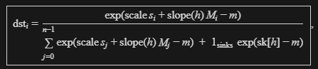

# 算子名称： GGML_OP_SOFT_MAX

要求： 考虑多 stream

「下文以 llama MHA 为例」

## 输入
  inp = Q @ K^T

    dtype: FP32

    shape: [n_kv, n_tokens / n_stream, n_heads, n_stream]

  attn_mask（可选）：

    dtype： FP16 或者 FP32

    shape：[n_kv, mask_ne1, 1, n_stream]

    这里 mask_ne1 需要 >= n_tokens / n_stream

  sink（可选，部分模型用的「额外槽位」logit）：

    dtype： FP32

    shape：[n_heads]

    训练得到的权重参数，每个头一个；

    用于长上下文、滑窗等场景下稳定分配注意力质量；

    模型架构：LLM_ARCH_OPENAI_MOE、LLM_ARCH_MIMO2 等模型会带 attn_sinks 这类参数。
    
## 参数
  1 scale = 1./sqrt(k_head_dims)

  2 alibi_bias

    当alibi_bias > 0.时，要求 attn_mask 必须存在

## 输出
  inplace输出： 与 inp 复用一块数据区域

  非 inplace 输出： 申请一个额外的空间：

    dtype 和 shape 均与 inp 一致

## 限制
  inp 连续

  attn_mask 连续

  attn_mask->ne[0] == inp->ne[0]

  attn_mask->ne[1] >= inp->ne[1]

  inp->ne[2] % attn_mask->ne[2] == 0

  inp->ne[3] % attn_mask->ne[3] == 0

  attn_mask->ne[2]如果为1，表示所有的 head 公用一张 mask attn_mask->ne[3]可与 n_stream 对齐或者再广播

## 实现原理

**参考CPU的实现**

### 1 计算 Alibi 斜率

  令 L = 2^floor(log2(n_heads)):    // L: 不大于 n_heads 的最大 2 的幂

  则：m0 = 2^(-max_bias/L), m1 = 2^(-max_bias/2/L)

               |    1,  max_bias <= 0
    slope(h) = |    m0^(h+1),  max_bias > 0, h < L
               |    m1^(2*(h - L) + 1), max_bias > 0, h >= L

### 2 加 mask 与 乘 scale
  对每个i ∈ {0, ..., n_kv - 1}：

  无mask（src1 == null）

    z_i = scale * s_i

  有mask：

    z_i = scale * s_i + slope(h) * M_i

  其中s_i为：inp在ne0维度上第 i 个位置上的值

  M_i为：attn_mask 与 inp 在后两个维度上广播对齐之后的一行，对每个 i ∈ [0, n_kv)，M_i 就是这个向量上的第 i 个元素。若 mask->type 是 F16，则需要将M_i转换成FP32后再进行计算
  
### 3 Attention sinks
  若sinks存在，且对每一个head都有一个标量的sinks[h]:

    m = max(max(z_i), sinks[h]), 其中 i >=0 && i < n_kv

  若没有sinks：

    m = max(z_i), 其中 i >=0 && i < n_kv

### 4 softmax
  保持数值稳定：先减 m：

    t_i = exp(z_i - m)

    S = sum(t_i), i>=0, i < n_kv

  若有sinks， 再把 sink 维并入分母：

    S = S + exp(sinks[h] - m)

### 5 输出
  result = t_i / S

## 公式

