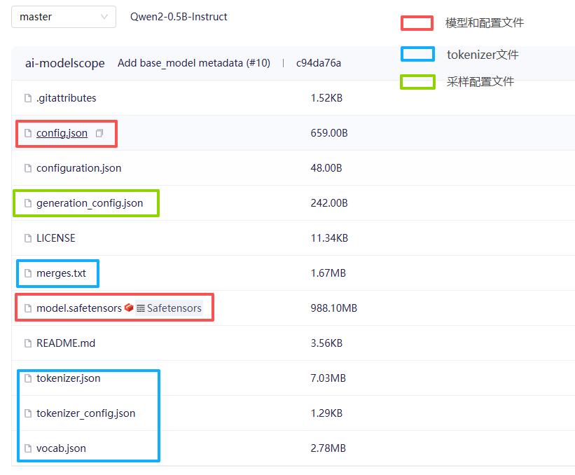

模型： [Qwen2-0.5B-Instruct](https://modelscope.cn/models/Qwen/Qwen2-0.5B-Instruct/files)



---

# 一、模型结构

* 参数量：约 0.5B（≈ 5亿） (fp16类型，权重大小约1G)
* 架构：**Decoder-only Transformer**

---

## 1. 整体结构（宏观）

```text
Input tokens
   ↓
Embedding
   ↓
N层 Transformer Block（≈20~30层）
   ↓
LM Head（线性层）
   ↓
Logits（词表概率）
```

本质：得到 在输出为 t 个tokens 时，第 t+1 个token在词表中的条件概率：P(x_t | x_0, ..., x_{t-1})

通过对词表进行采样，可以输出token对应的字符

网络结构是写在框架中的，如transformers、Megatron-LM、vLLM、SGLang等

---

## 2. 单个 Transformer Block

每一层包含：

```text
x
 ↓
RMSNorm
 ↓
Attention（MHA/GQA/MLA等）
 ↓
Residual Add
 ↓
RMSNorm
 ↓
MLP（SwiGLU）
 ↓
Residual Add
```

---

## 3. Attention（Qwen2的关键点）

### （1）GQA（Group Query Attention）

区别于普通 MHA：

| 类型  | Q       | K/V   |
| --- | ------- | ----- |
| MHA | 每头独立    | 每头独立  |
| GQA | 多Q共享K/V | K/V更少 |

* KV cache更小
* 推理更快

---

### （2）Attention计算

Attention(Q,K,V)=softmax(Q @ K^T / sqrt(d_k) + causual_mask) @ V

---

## 4. MLP（SwiGLU）

不是简单 FFN，而是：

```
SwiGLU(x) = (x @ W_1) dot sigmoid(x @ W_2)

mlp_out = down(SwiGLU)
```
---

# 二、从 prompt → tokens 的完整推理流程

---

# Step 0：用户输入

```text
"写一个快速排序"
```

---

# Step 1：Tokenizer

tokens:   
```
[15123,     9231,      8821,     ...]

input_ids   input_id   input_id  ... 
```

# Step 2：Embedding

将这些 input_id 转换成 连续的浮点向量

# Step 3：Prefill阶段

## 什么是 Prefill？

将输入的tokens，一次性送进decoder进行处理

## 过程：

### 1 每一层计算：

* Q, K, V
* Attention（全量）
* 输出 hidden state

---

### 2 存储 KV cache：

```text
K_cache = [K0, K1, ..., K(n-1)]
V_cache = [V0, V1, ..., V(n-1)]
```

> **后面再也不用重新计算历史token**
> 输入序列长度越长，prefill阶段K V cache占用的存储空间越大

---

## 3 输出最后一个 token 的 logits

```text
logits = LM_head(h_last)
```

---

# 4：采样第一个新 token

从 logits 得到概率：

P = softmax(logits)

---

## 采样策略：

### 1. Greedy

argmax(P)


### 2. Temperature

P_i = exp(logit_i / T) / sum(exp(logit_j / T))

### 3. Top-k

只保留前 k 个


### 4. Top-p（nucleus sampling）

选择累计概率 ≥ p 的最小集合

---

# 5：Decode阶段（逐token生成）

现在开始循环：

---

## 每一步生成：

假设刚生成 token tₙ：

### 输入：

```text
当前token：tₙ
KV cache：之前对所有 token 已经计算好，并且缓存起来的 K 和 V
```

### 计算

- 计算： Q(tₙ)、K(tₙ)、V(tₙ)

- 更新 KV cache：

```text
K_cache.append(Kₙ)
V_cache.append(Vₙ)
```

计算attention： Attention(Q, K_cache, V_cache)

为了加快计算速度，历史token对应的K 和 V已经缓存，随着生成token逐渐增多，KV cache占用的存储空间将会越来越大！

### KV cache 空间占用计算

```
inp: [bsz, n_tokens, hidden_size]

Q_weight: [hidden_size, n_heads*head_dims]

K_weight/V_weight : [hidden_size, n_kv_heads*head_dims]

K/V: [bsz, n_tokens, n_kv_heads*head_dims]

```

一个token对应的 K/V 的 shape: [n_kv_heads, head_dims]

占用存储空间：(1+1) *bsz * n_tokens * n_kv_heads * head_dims * sizeof(dtype) * n_layers

对于qwen2.5-0.5B模型：
2 * bsz * n_tokens * 2 * (896 / 14) * sizeof(bf16) * 24 = 12K * bsz * n_tokens

#### 举例：
n_tokens 使用 模型训练得到的上下文长度：32 K，一个序列 KV cache 的大小：

```text
12K * 1 * 32K = 384 M
```

- 实际上，在使用YaRN等扩展手段的时候会数倍于 n_ctx
- 对于多请求输入成倍增长
- 对于 VL、audio或者全能模型来说，需要 KV cache 的空间占用更加恐怖
- 对于大规模的模型，为了表达更强语义，其 head_dims、n_kv_heads 以及 n_layers 会更大

---

### 输出：

```text
logits → 采样 → tₙ₊₁
```

---

## 循环直到：

* 遇到 `<eos>`
* 或 max length(配置的数据)

## 完整流程：

```text
用户输入 prompt
   ↓
Tokenizer → input_ids
   ↓
Embedding
   ↓
Transformer（Prefill）
   ↓
得到 logits
   ↓
采样 → 第一个token
   ↓
进入循环：
   每次：
     - 用已经缓存的历史token的KV cache + 对当前token计算 KV cache
     - 计算当前token的输出logits
     - sampler根据logits采样下一个token
```
