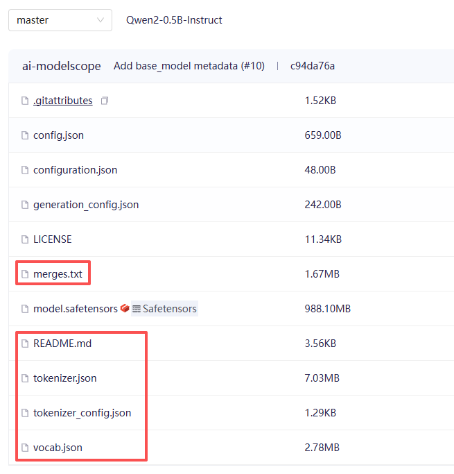

在大模型体系里，**tokenizer 不是一个附属组件，而是“信息入口的协议层”**。模型只接受数字（token id），而人类输入是字符串, tokenizer 的作用：

**把连续文本 → 离散符号空间的压缩编码器**


---

# 一、Tokenizer 的作用（本质）

## 1. 基本功能

把文本：

```text
"ChatGPT is amazing!"
```

转换为：

```text
["Chat", "G", "PT", " is", " amazing", "!"]
→ [5023, 71, 1923, 318, 1045, 0]
```

---

## 2. 更本质的作用

### （1）定义模型的“基本单位”

模型只能处理**token（子词单位）**

token 是一种折中：

* 比字符更有语义
* 比单词更灵活

---

### （2）影响模型性能的关键因素

Tokenizer 会直接影响：

#### 序列长度

* 好 tokenizer → 更短序列 → 更高效
* 差 tokenizer → token 爆炸

#### 语义表达能力

例如：

* “unbelievable”

  * 好：["un", "believable"]
  * 差：["u","n","b","e","l","i","e",...]

#### 多语言能力

* 是否能公平处理中文/英文/代码

---

# 二、Tokenizer 的类别

主流可以分为 4 类（从简单到复杂）

---

## 1. Character-level（字符级）

### 方法：

每个字符一个 token

```text
"cat" → ["c","a","t"]
```

### 优点：

* 不会 OOV（未知词）
* 简单

### 缺点：

* 序列极长 
* 语义弱 

几乎不用在大模型中

---

## 2. Word-level（词级）

### 方法：

按词切分

```text
"I love NLP" → ["I", "love", "NLP"]
```

### 优点：

* 语义清晰

### 缺点：

* OOV严重 
* 词表巨大 

早期 NLP 使用（如 word2vec）

---

## 3. Subword-level（主流方案 ）

是当前所有大模型核心方案

核心思想：

> **高频词保留，低频词拆分**

---

### 常见算法：

---

1）BPE（Byte Pair Encoding）

2）WordPiece（BERT 使用）

3）Unigram LM（SentencePiece ⭐）

4）Byte-level BPE（GPT-2 / GPT-4 类）

总之，Tokenizer是需要通过**训练**得到的，它是将人类输入的字符转换成计算机可以识别的整数的转换工具

---

tokenizer是一类具有分词功能，并将分词转换为整形数据的模型

特殊 token：

```text
[CLS], [SEP], <bos>, <eos>
```
词表：vocabulary，是训练完成之后的 tokenizer 能够认识的所有 **分词** 与 **整数** 的对应关系


# 三. 训练流程（以 BPE 为例）

---

### Step 1：初始化

把文本拆成字符：

```text
"low" → ["l","o","w"]
```

---

### Step 2：统计频率

统计所有 token pair：

```text
("l","o") → 1000 次
("o","w") → 800 次
```

---

### Step 3：合并最高频 pair

```text
("l","o") → "lo"
```

---

### Step 4：更新语料

```text
["l","o","w"] → ["lo","w"]
```

---

### Step 5：重复直到 vocab size 满足

---

# 四、工程实现

常用工具：

* HuggingFace Tokenizers（Rust实现，超快）
* SentencePiece（Google）
* tiktoken（OpenAI）

